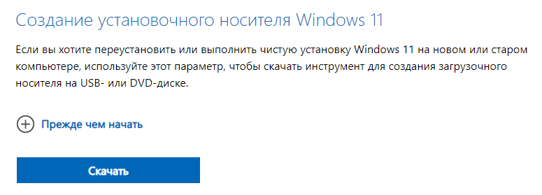

Установка Windows 11, пошагово

1. Желательно с включенным VPN, зайдите на этот сайт (https://www.microsoft.com/ru-ru/software-download/windows11) и нажмите "Скачать" в пункте "Создание установочного носителя Windows 11"

2. После прошлого пункта, скачается установщик "MediaCreationTool_Win11", запускаем его. в нём выбираем:
   1. Принять
   2. Язык: Русский, Выпуск: Windows 11
   3. ISO-файл
   4. Выбираем папку, куда этот файл будет установлен
   5. Ждём окончания загрузки (будет долго, пока можно выполнять следующие пункты)

3. Сохраните все важные файлы с компа, чтобы потом не потерять их
4. Полностью очистите какую-нибудь флешку, желательно, чтобы она была объёмом $\geqslant$ 8 ГБ
5. Скачайте и установите программу Rufus (https://github.com/pbatard/rufus/releases/download/v4.4/rufus-4.4.exe)
6. После того, как образ винды будет загружен, запустите Rufus и отметьте следующие пункты:
   1. Устройство - выберите вашу флешку
   2. Метод загрузки: диск или ISO-образ
   3. Слева кнопка "Выбрать" - нажмите и выберите образ винды